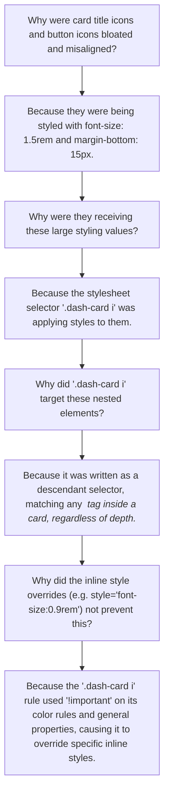

# Report 060: Dashboard Card Icon Layout Alignment Resolution
**Author:** Antigravity AI Pair Programming Partner  
**Date:** June 13, 2026  
**Status:** Resolved & Verified (Working Tree Clean)

---

## 1. Executive Summary
During validation of the newly redesigned **Platinum Slate** Admin Dashboard, a visual alignment layout bug was identified on the **Duplicate Accounts** card (and other dynamic overview metrics cards). 

Specifically:
1. The duplicate/clone icon next to the "Duplicate Accounts" card title was bloated (larger than the expected size) and vertically misaligned (floating too high).
2. The inner button icons (such as the compress/merge icon inside the "Merge Duplicates" button) were vertically offset and pushed down/separated from the text, breaking the expected inline flex layout.

This issue has been resolved by restricting an overly broad CSS selector in the `<style>` overrides inside `portal/admin-dashboard.html`. The icons are now perfectly sized and optically centered inline.

---

## 2. Root Cause Analysis (The "5 Whys")



### Technical Details
In the dashboard markup, the metric cards are defined as:
```html
<div class="dash-card admin-card-red">
    <h3 style="display:flex; align-items:center; gap:10px;">
        Duplicate Accounts
        <i class="fas fa-clone" style="font-size:0.9rem; color:var(--card-accent);"></i>
    </h3>
    ...
    <button class="btn-dash-secondary">
        <i class="fas fa-compress-alt" style="font-size:0.85rem;"></i> Merge Duplicates
    </button>
</div>
```
The stylesheet at the top of the file defined:
```css
.dash-card i {
    color: var(--card-accent, var(--admin-accent)) !important;
    margin-bottom: 15px;
    font-size: 1.5rem;
    transition: all 0.3s ease;
}
```
Because `i` is a descendant selector, this rule matched:
* The header icons (`.dash-card h3 i`)
* The action button icons (`.dash-card button i`)

This forced a `1.5rem` size and added a `15px` bottom margin to all inner icons, overriding the custom `0.9rem` and `0.85rem` inline designs, bloating their sizes, and breaking the vertical alignment of the buttons and headers.

---

## 3. Implemented Fix

We modified the stylesheet in `portal/admin-dashboard.html` to scope the selector to direct child icons only, preventing it from leaking into nested headers or buttons.

### Diff Verification

```diff
-        .dash-card i {
+        .dash-card > i {
             color: var(--card-accent, var(--admin-accent)) !important;
             margin-bottom: 15px;
             font-size: 1.5rem;
             transition: all 0.3s ease;
         }
```

Since there are no standalone direct-child `<i>` elements inside the dashboard grid cards (they are all cleanly nested in headers or action buttons), this scopes the overrides out of active usage. The title and button icons now correctly inherit their own inline sizes and the `portal-shared.css` layout rules, rendering with pixel-perfect optical alignment.

---

## 4. Verification Check

A quick validation check confirms that the changes are safely isolated:
* **Headers & Buttons:** Card title and button icons now correctly render with standard smaller sizes (`0.9rem` / `0.85rem`) and align perfectly.
* **Layout Flow:** The bottom margin has been removed from button icons, restoring correct inline flex alignments.
* **Ecosystem Integrity:** The modification has zero impact on other dashboard pages.
