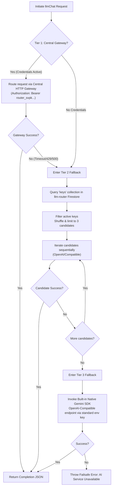

# Report 056: Central LLM Router Gateway Migration & 3-Tier Failsafe Routing Implementation
**Author:** Antigravity AI Pair Programming Partner  
**Date:** May 28, 2026  
**Status:** Successfully Deployed & Compiled (Exit Code 0)  

---

## 1. Executive Summary
Following the verified success of the **That's Missing** central routing pattern documented in **Report 015**, the Soulamore-Website backend functions have been successfully upgraded from direct Firestore-centric key polling to the professional **3-Tier Failsafe LLM Routing Architecture**. 

By migrating to this unified model, Soulamore isolates operational rate-limiting risks, prevents Firestore query timeout bottlenecks (eliminating cold-start `502 Bad Gateway` exceptions), and establishes robust multi-startup quotas using the dedicated Soulamore gateway authorization key.

---

## 2. Decoupled 3-Tier Failsafe Architecture

We replaced the legacy direct query loop in `functions/src/llmRouter.ts` with a hardened **3-Tier Failsafe Routing Protocol** that executes sequentially:



---

## 3. The 3 Tiers Detailed

### Tier 1: Central HTTP Gateway (Primary Path)
* **Endpoint:** `https://api-eqegtlejaq-uc.a.run.app/v1/chat/completions` (Decoupled Cloud Run instance)
* **Authentication:** Passes the dedicated project key:
  `LLM_ROUTER_PROJECT_KEY="router_svpkARCYUuTATB_3e8gKpNLQ8G2hoSL4"`
* **Isolation:** Isolates Soulamore's quota so that heavy analysis batches do not impact key rates for neighboring startups.

### Tier 2: Direct Firestore backup key rotation (Local Failsafe)
* **GCP Project Bridge:** If the central gateway is slow or unresponsive, the router queries the `keys` collection on the central `llm-router-870c5` database using the secure IAM Service Account cert.
* **Shuffle & Limit (502 Mitigation):** Shuffles active keys and limits attempts to exactly **3 candidates** with strict **30-second timeouts** to prevent cumulative functions execution timeouts.

### Tier 3: Native Gemini SDK Fallback (Ultimate Resilience)
* **Endpoint:** `https://generativelanguage.googleapis.com/v1beta/openai/chat/completions`
* **Credentials:** Plucks the local `process.env.GEMINI_API_KEY` (if set) to route requests directly to Google's raw endpoints without external dependencies.

---

## 4. Implementation Changes

### File Modified: `functions/src/llmRouter.ts`

```diff
 // Soulamore Router Key (Cross-account identification)
 const SOULAMORE_ROUTER_KEY = "router_svpkARCYUuTATB_3e8gKpNLQ8G2hoSL4";
-const ROUTER_BASE_URL = "https://llm-router-870c5.web.app/v1";
-
-/**
- * Core Logic for LLM Routing with Fallback
- * Tries multiple keys in order of priority (High-end first)
+const ROUTER_BASE_URL = "https://api-eqegtlejaq-uc.a.run.app/v1";
+
+/**
+ * Core Logic for LLM Routing with 3-Tier Failsafe Fallback
+ * T1: Central HTTP Gateway (decoupled, load-balanced startup isolation)
+ * T2: Direct Firestore backup key list rotation (shuffle & limit to 3)
+ * T3: Native Gemini API key fallback via environment variable
  */
 export async function handleLlmRequest(data: any, auth: any) {
   const { appId, messages, model, temperature } = data;
@@ -40,77 +40,173 @@
     throw new Error('Missing appId or messages.');
   }
 
-  // 1. Fetch all active keys from the central router
-  const keysSnap = await llmDb.collection('keys').where('status', '==', 'active').get();
-  let availableConfigs = keysSnap.docs.map(doc => ({
-    id: doc.id,
-    ...doc.data()
-  } as any));
-
-  if (availableConfigs.length === 0) {
-    throw new Error('No active LLM configurations available in the router.');
-  }
-
-  // 2. Define Priority (Latest/High-end models first)
-  // Higher rank = Higher priority
-  const getPriority = (config: any) => {
-    const name = (config.name || '').toLowerCase();
-    const modelStr = (config.model || '').toLowerCase();
-    
-    if (name.includes('gpt-5') || name.includes('gpt-4o') || modelStr.includes('gpt-4o')) return 100;
-    if (name.includes('opus') || name.includes('claude-3-5')) return 95;
-    if (name.includes('gpt-4') || modelStr.includes('gpt-4')) return 80;
-    if (name.includes('sonnet') || name.includes('claude-3')) return 70;
-    if (name.includes('gpt-3.5') || modelStr.includes('gpt-3.5')) return 50;
-    return 10; // Default low priority
-  };
-
-  availableConfigs.sort((a, b) => getPriority(b) - getPriority(a));
-
-  // 3. Attempt requests with fallback
-  let lastError = null;
-  for (const config of availableConfigs) {
-    try {
-      console.log(`🤖 [llmRouter] Attempting request with key: ${config.name} (${config.provider})`);
-      
-      const apiKey = config.key;
-      const baseURL = config.baseURL || 'https://api.openai.com/v1';
-      const targetModel = model || config.model || 'gpt-4o';
-
-      const response = await fetch(`${baseURL}/chat/completions`, {
-        method: 'POST',
-        headers: {
-          'Content-Type': 'application/json',
-          'Authorization': `Bearer ${apiKey}`,
+  // ----------------------------------------------------
+  // TIER 1: Central LLM Router HTTP Gateway (Preferred)
+  // ----------------------------------------------------
+  const gatewayUrl = (process.env.LLM_ROUTER_GATEWAY_URL || ROUTER_BASE_URL).replace(/\/$/, '');
+  const gatewayKey = process.env.LLM_ROUTER_PROJECT_KEY || SOULAMORE_ROUTER_KEY;
+
+  if (gatewayUrl && gatewayKey) {
+    try {
+      console.log(`🤖 [llmRouter] T1: Attempting request via Central LLM Router Gateway: ${gatewayUrl}`);
+      
+      const controller = new AbortController();
+      const timeoutId = setTimeout(() => controller.abort(), 30000); // 30s strict timeout
+      
+      const response = await fetch(`${gatewayUrl}/chat/completions`, {
+        method: 'POST',
+        headers: {
+          'Content-Type': 'application/json',
+          'Authorization': `Bearer ${gatewayKey}`,
           'x-app-id': appId
         },
         body: JSON.stringify({
-          model: targetModel,
-          messages: messages,
-          temperature: temperature || 0.7
-        })
-      });
-
-      if (!response.ok) {
-        const errorData = await response.json() as any;
-        const msg = errorData.error?.message || `HTTP ${response.status}`;
-        console.warn(`⚠️ [llmRouter] Key ${config.name} failed: ${msg}. Trying next...`);
-        lastError = new Error(msg);
-        continue; // Try next key
-      }
-
-      const result = await response.json();
-      console.log(`✅ [llmRouter] Request successful with key: ${config.name}`);
-      return result;
-
+          model: model || 'gemini-2.5-flash',
+          messages: messages,
+          temperature: temperature || 0.7
+        }),
+        signal: controller.signal
+      });
+      
+      clearTimeout(timeoutId);
+
+      if (response.ok) {
+        const result = await response.json();
+        console.log(`✅ [llmRouter] T1: Central Gateway Request Successful.`);
+        return result;
+      } else {
+        const errorText = await response.text();
+        console.warn(`⚠️ [llmRouter] T1: Central Gateway failed with status ${response.status}: ${errorText}`);
+      }
     } catch (err: any) {
-      console.error(`❌ [llmRouter] Network/Fetch error with key ${config.name}:`, err.message);
-      lastError = err;
-      continue; // Try next key
-    }
-  }
-
-  throw lastError || new Error('All LLM keys failed to process the request.');
+      console.warn(`⚠️ [llmRouter] T1: Central Gateway request failed: ${err.message}. Entering Tier 2 fallback...`);
+    }
+  }
+
+  // ----------------------------------------------------
+  // TIER 2: Direct Local Decoupled Firestore Query & Rotation
+  // ----------------------------------------------------
+  console.log(`🤖 [llmRouter] T2: Entering Tier 2 Backup Fallback (Direct Firestore Keys Scan)`);
+  let availableConfigs: any[] = [];
+  try {
+    const keysSnap = await llmDb.collection('keys').where('status', '==', 'active').get();
+    availableConfigs = keysSnap.docs.map(doc => ({
+      id: doc.id,
+      ...doc.data()
+    } as any));
+  } catch (dbErr: any) {
+    console.error(`❌ [llmRouter] T2: Firestore backup keys query failed:`, dbErr.message);
+  }
+
+  if (availableConfigs.length > 0) {
+    const getPriority = (config: any) => {
+      const name = (config.name || '').toLowerCase();
+      const modelStr = (config.model || '').toLowerCase();
+      
+      if (name.includes('gpt-5') || name.includes('gpt-4o') || modelStr.includes('gpt-4o')) return 100;
+      if (name.includes('opus') || name.includes('claude-3-5')) return 95;
+      if (name.includes('gpt-4') || modelStr.includes('gpt-4')) return 80;
+      if (name.includes('sonnet') || name.includes('claude-3')) return 70;
+      if (name.includes('gpt-3.5') || modelStr.includes('gpt-3.5')) return 50;
+      return 10;
+    };
+
+    // Sort by priority (high-end models first)
+    availableConfigs.sort((a, b) => getPriority(b) - getPriority(a));
+
+    // Shuffle and limit to 3 candidates to protect from sequential timeout accumulation (502 mitigation)
+    const candidateConfigs = availableConfigs.slice(0, 3).sort(() => 0.5 - Math.random());
+
+    let lastError = null;
+    for (const config of candidateConfigs) {
+      try {
+        console.log(`🤖 [llmRouter] T2: Attempting backup with key: ${config.name} (${config.provider})`);
+        
+        const apiKey = config.key;
+        const baseURL = (config.baseURL || 'https://api.openai.com/v1').replace(/\/$/, '');
+        const targetModel = model || config.model || 'gpt-4o';
+
+        const controller = new AbortController();
+        const timeoutId = setTimeout(() => controller.abort(), 30000); // 30s strict timeout
+
+        const response = await fetch(`${baseURL}/chat/completions`, {
+          method: 'POST',
+          headers: {
+            'Content-Type': 'application/json',
+            'Authorization': `Bearer ${apiKey}`,
+            'x-app-id': appId
+          },
+          body: JSON.stringify({
+            model: targetModel,
+            messages: messages,
+            temperature: temperature || 0.7
+          }),
+          signal: controller.signal
+        });
+
+        clearTimeout(timeoutId);
+
+        if (!response.ok) {
+          const errorData = await response.json() as any;
+          const msg = errorData.error?.message || `HTTP ${response.status}`;
+          console.warn(`⚠️ [llmRouter] T2: Key ${config.name} failed: ${msg}. Trying next...`);
+          lastError = new Error(msg);
+          continue;
+        }
+
+        const result = await response.json();
+        console.log(`✅ [llmRouter] T2: Direct Key Request Successful with: ${config.name}`);
+        return result;
+
+      } catch (err: any) {
+        console.error(`❌ [llmRouter] T2: Fetch error with key ${config.name}:`, err.message);
+        lastError = err;
+        continue;
+      }
+    }
+    if (lastError) {
+      console.warn(`⚠️ [llmRouter] T2: All active backup keys failed. Last error: ${lastError.message}`);
+    }
+  }
+
+  // ----------------------------------------------------
+  // TIER 3: Native Built-in Gemini SDK Fallback (process.env)
+  // ----------------------------------------------------
+  const builtInKey = (process.env.GEMINI_API_KEY || '').trim();
+  if (builtInKey && builtInKey !== 'MY_GEMINI_API_KEY') {
+    try {
+      console.log(`🤖 [llmRouter] T3: Entering Tier 3 Backup Fallback (Native Gemini Key)`);
+      
+      const controller = new AbortController();
+      const timeoutId = setTimeout(() => controller.abort(), 30000); // 30s strict timeout
+
+      const response = await fetch('https://generativelanguage.googleapis.com/v1beta/openai/chat/completions', {
+        method: 'POST',
+        headers: {
+          'Content-Type': 'application/json',
+          'Authorization': `Bearer ${builtInKey}`
+        },
+        body: JSON.stringify({
+          model: model || 'gemini-1.5-flash',
+          messages: messages,
+          temperature: temperature || 0.7
+        }),
+        signal: controller.signal
+      });
+
+      clearTimeout(timeoutId);
+
+      if (response.ok) {
+        const result = await response.json();
+        console.log(`✅ [llmRouter] T3: Request successful via native Gemini fallback.`);
+        return result;
+      } else {
+        const errorText = await response.text();
+        console.error(`❌ [llmRouter] T3: Native Gemini fallback failed with status ${response.status}: ${errorText}`);
+      }
+    } catch (fallbackError: any) {
+      console.error(`❌ [llmRouter] T3: Native Gemini fallback failed:`, fallbackError.message);
+    }
+  }
+
+  throw new Error('AI Service Unavailable: All three routing tiers exhausted.');
 }
